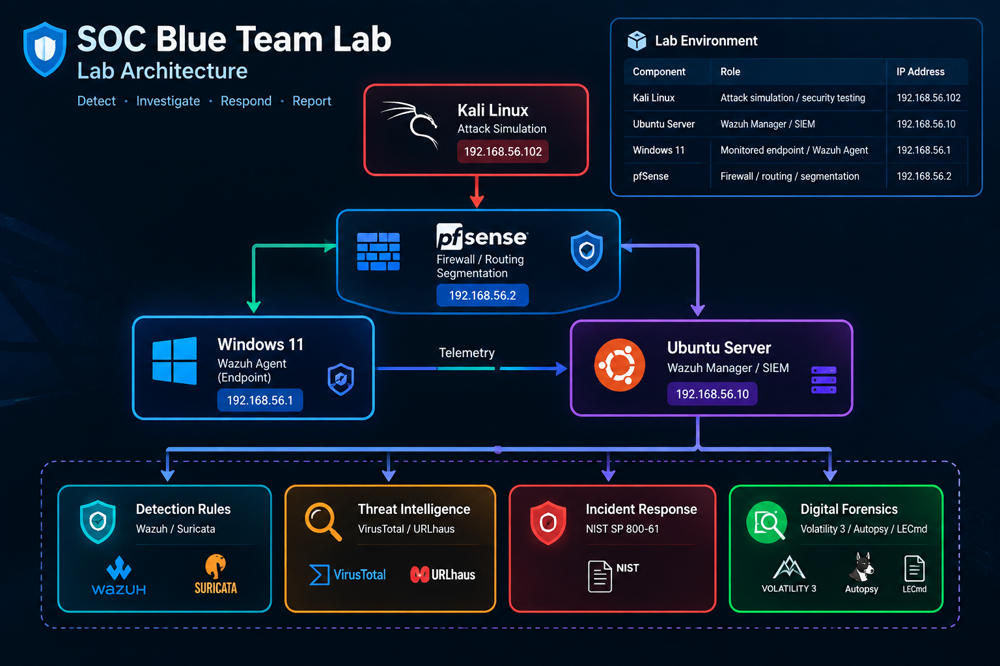
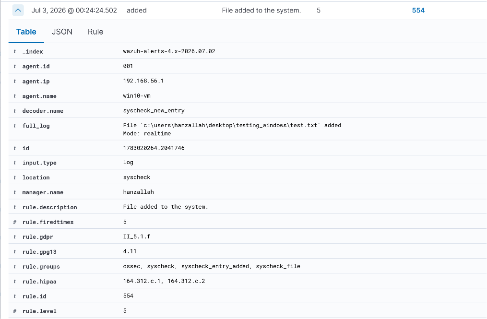
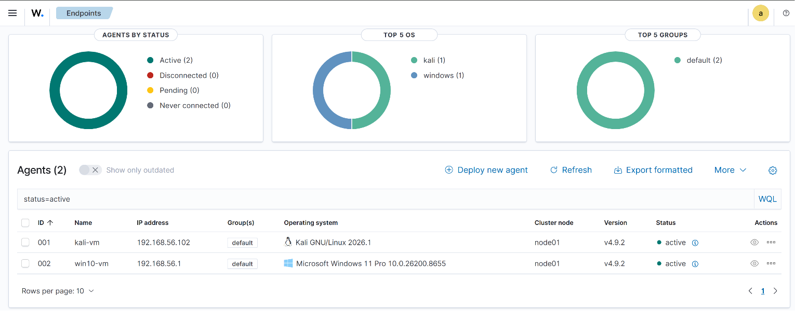
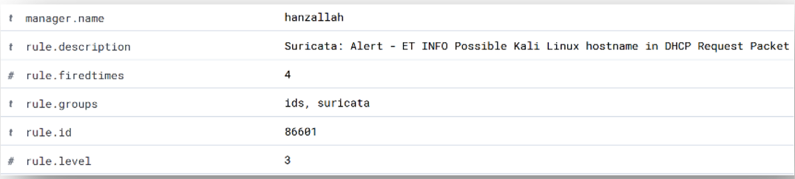
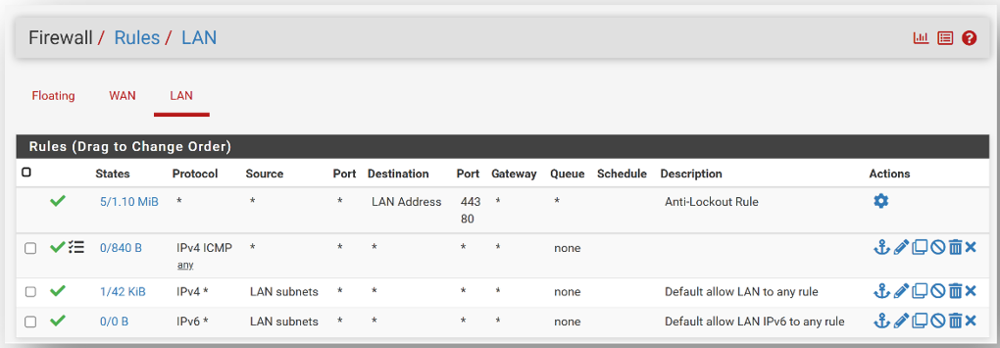
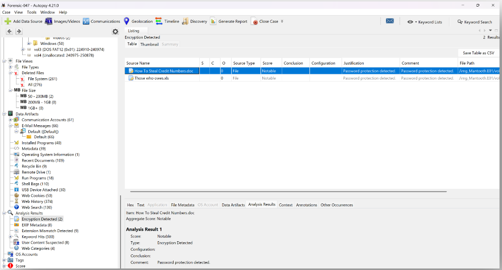

<h1 align="center">🛡️ SOC Blue Team Lab — Cyberster Internship</h1>

<p align="center">
🔴 Detect • 🟣 Investigate • 🟢 Respond • 🔵 Report
</p>

<p align="center">


</p>

<p align="center">


</p>

---

## 📖 Project Summary

The **SOC Blue Team Lab** simulates a real-world enterprise security operations
environment — built during a 90-day Blue Team SOC Analyst internship at Cyberster.
It integrates SIEM deployment, network segmentation, intrusion detection, threat
intelligence, incident response, and digital forensics into one continuous,
hands-on workflow.

Unlike a single-purpose tutorial lab, this project evolved week over week: starting
from basic log analysis, progressing through detection engineering and network
segmentation with pfSense, and culminating in full incident response and DFIR
capstone investigations.

---

## 🎯 Objectives

- ✅ Build a multi-VM SOC lab with segmented, routed network topology
- ✅ Deploy and tune Wazuh SIEM across Windows and Linux endpoints
- ✅ Develop custom detection rules (Wazuh + Suricata)
- ✅ Integrate threat intelligence feeds mapped to MITRE ATT&CK
- ✅ Conduct incident response following NIST SP 800-61
- ✅ Perform digital forensics investigations (Volatility 3, browser/LNK/USB analysis)

---

## 🖥️ Lab Architecture

### Architecture Diagram



| Component | Role | IP |
|---|---|---|
| Kali Linux | Attacker / testing box | 192.168.56.102 |
| Ubuntu Server (Wazuh Manager) | SIEM, FIM, log analysis | 192.168.56.10 |
| Windows 11 (agent: `win10-vm`) | Monitored endpoint — Wazuh agent | 192.168.56.1 |
| pfSense | Firewall / network segmentation (LAN) | 192.168.56.2 |

Networking: VirtualBox host-only network, later re-routed through pfSense so all
inter-VM traffic is filtered and segmented rather than flat.

```text
                         ┌─────────────────────┐
                         │     Kali Linux      │
                         │ Attack Simulation   │
                         └──────────┬──────────┘
                                    │
                                    ▼
                         ┌─────────────────────┐
                         │       pfSense       │
                         │ Firewall / Routing  │
                         │    Segmentation     │
                         └──────────┬──────────┘
                                    │
                     ┌──────────────┴──────────────┐
                     │                             │
                     ▼                             ▼
             ┌───────────────┐             ┌───────────────┐
             │  Windows 11   │             │ Ubuntu Server │
             │ Wazuh Agent   │────────────►│ Wazuh Manager │
             │    Endpoint   │   Telemetry │     / SIEM    │
             └───────────────┘             └───────┬───────┘
                                                   │
                         ┌─────────────────────────┼─────────────────────┐
                         │                         │                     │
                         ▼                         ▼                     ▼
                  Detection Rules          Threat Intelligence       Incident
                  Wazuh / Suricata         VirusTotal / URLhaus       Response
                                                                           │
                                                                           ▼
                                                                  Digital Forensics
```

### SOC Investigation Workflow

```text
1. Generate / Observe Event
            ↓
2. Collect Telemetry
            ↓
3. Detect & Alert
            ↓
4. Investigate Evidence
            ↓
5. Enrich with Threat Intelligence
            ↓
6. Map to MITRE ATT&CK
            ↓
7. Respond / Contain
            ↓
8. Document Findings
            ↓
9. Perform Forensic Analysis
```

---

## 📂 Repository Structure

| Folder | Contents |
|---|---|
| `01-Lab-Setup` | VM builds, networking, base configuration |
| `02-Wazuh-Deployment` | Agent enrollment, FIM, event log monitoring |
| `03-Detection-Engineering` | Custom Wazuh & Suricata rules |
| `04-Network-Segmentation` | pfSense setup, routing, firewall rules |
| `05-Threat-Intelligence` | VirusTotal, URLhaus, MITRE ATT&CK mapping |
| `06-Incident-Response` | NIST 800-61 IR reports, insider threat simulation |
| `07-Digital-Forensics` | Browser/LNK/USB forensics, Volatility 3 capstone |
| `docs-archive` | Full week-by-week internship reports (raw archive) |

---

## 🔍 Detection Engineering

### Wazuh File Integrity Detection



### Wazuh Agent Monitoring



### Suricata Alert



---

## 🔍 Notable Findings

- **VirusTotal API v2 → v3 patch** — Wazuh 4.14.5's bundled `virustotal.py`
  integration script targets the deprecated VirusTotal API v2 endpoint, which
  fails against valid v3 keys. Identified and patched it to use the v3 endpoint
  with correct header-based authentication — documented as a genuine
  visibility-gap finding.
- **Silent detection rule failure** — A custom Wazuh rule failed to fire with no
  error, caused by referencing the wrong FIM event field (`file` instead of the
  actual `syscheck.path`). Found by inspecting the raw alert JSON directly
  rather than trusting a clean service restart log.
- **pfSense boot failure on VirtualBox** — The pfSense VM refused to boot into
  64-bit long mode because Hyper-V held exclusive access to VT-x. Resolved by
  setting VirtualBox's paravirtualization interface to Hyper-V and correcting
  the guest OS type to 64-bit FreeBSD.

### pfSense Firewall Configuration



---

## 🧠 Skills Demonstrated

`MITRE ATT&CK` `NIST SP 800-61` `Detection Engineering` `Network Segmentation`
`SIEM/IDS Deployment` `Digital Forensics` `Volatility 3` `Threat Intelligence`

### 🧩 Skills Breakdown

- **Network Analysis** — Wireshark (ARP, DNS, HTTP, QUIC, ICMPv6), Suricata IDS
  in af-packet mode with custom rules, validated via offline PCAP replay
- **SIEM / Detection Engineering** — Wazuh agent deployment, File Integrity
  Monitoring, custom MITRE-mapped detection rules, Active Response automation
  (firewall-drop on SSH brute-force)
- **Threat Intelligence** — VirusTotal API v3 enrichment, Abuse.ch/URLhaus feeds
- **Malware Analysis** — Dynamic analysis via ANY.RUN sandbox, IOC/IOA extraction
- **Incident Response** — NIST SP 800-61 IR plans, insider threat simulation
  (staging, encoding, exfiltration, deletion), CyberChef decoding
- **Digital Forensics** — Browser forensics (Chrome/Edge/Firefox/Brave), LNK
  file analysis (LECmd), USB device forensics, memory forensics (Volatility 3),
  disk image analysis (Autopsy, .E01)
- **Network Security** — pfSense firewall configuration, GeoIP blocking
  (ipset/iptables), network segmentation

### Forensic Analysis



---

## 📊 Investigation Coverage

| Area | Technologies / Techniques |
|---|---|
| SIEM | Wazuh |
| IDS | Suricata |
| Firewall | pfSense |
| Network Analysis | Wireshark |
| Threat Intelligence | VirusTotal, URLhaus |
| Detection | Wazuh Rules, Suricata Rules |
| Frameworks | MITRE ATT&CK, NIST SP 800-61 |
| Incident Response | Investigation, containment, reporting |
| Memory Forensics | Volatility 3 |
| Disk Forensics | Autopsy, `.E01` |
| Artifact Analysis | Browser, LNK, USB |
| Malware Analysis | ANY.RUN |
| Automation | Wazuh Active Response |

---

## 🔗 Background

Completed as part of the **Cyberster SOC Analyst Internship (Batch 2)**. Weekly
progress also documented on [LinkedIn](https://www.linkedin.com/in/hanzallah-io/).

## 👨‍💻 Author

**Muhammad Hanzallah**
BS Data Science | Cybersecurity & Blue Team Operations

GitHub: **[hanzallah-io](https://github.com/hanzallah-io)**
LinkedIn: **[hanzallah-io](https://www.linkedin.com/in/hanzallah-io/)**